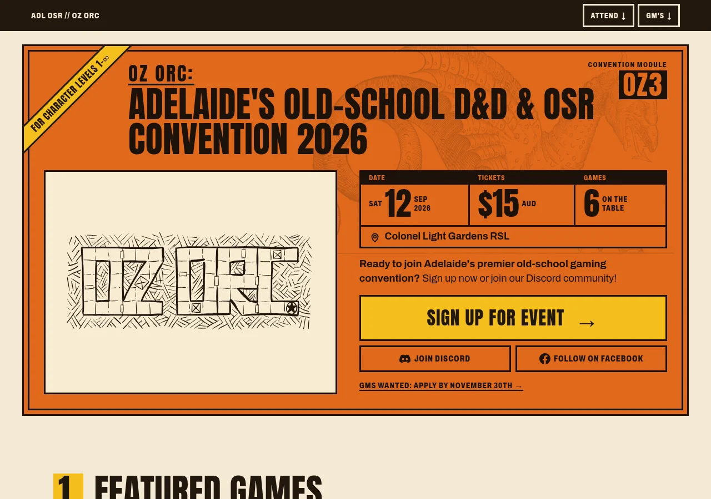
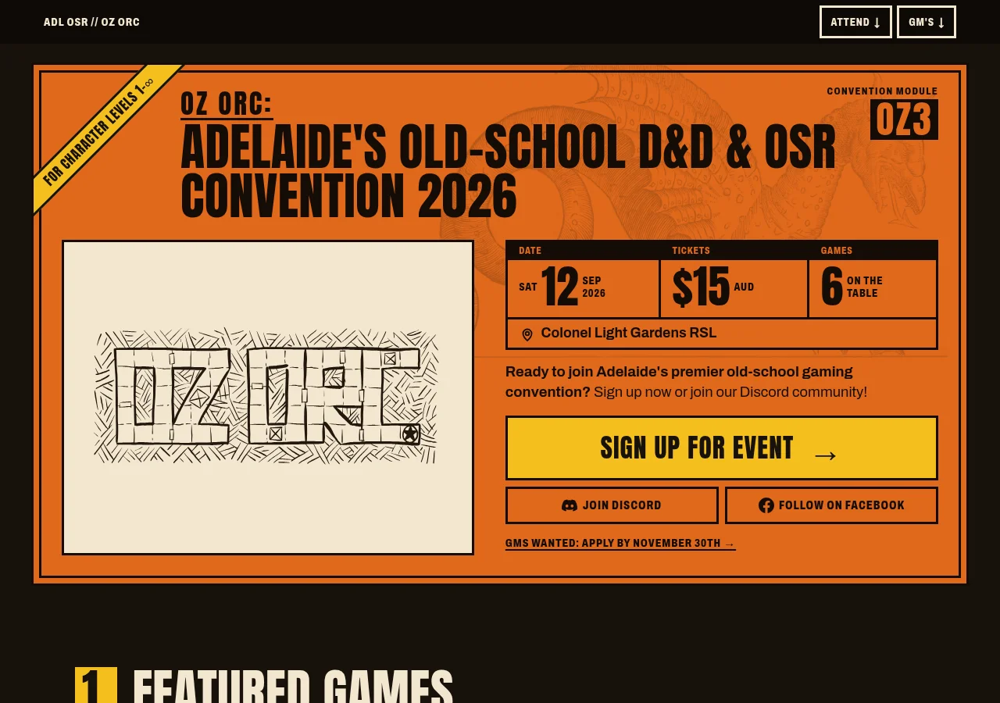

Branch: docs/oz-orc-look

# What should the OZ ORC homepage look like, settled

Date: 2026-09-27
Status: Adopted — "The Module, Loud" (TSR module cover, hazard-print type) with the
TSR Orange / Ember · Cream palette, the dragon woodcut, and a bottom command bar.

## Question

The site worked but looked plain and generic: stock daisyUI colours, system font, the
usual AI-template layout. The question was which visual direction to rebuild it in,
given that it is a landing page whose job is to funnel visitors to player sign-up
(Warhorn), GM applications, and Discord and Facebook — and that it must stay simple,
readable, and have both light and dark modes, keeping the OZ ORC logo. A wrong answer
would have cost a full restyle of every component twice.

## Verdict

**Option F, "The Module, Loud".** The page is an early-80s TSR adventure module: the hero
is a module cover (orange field, angled yellow corner banner, "OZ3" module code, the logo
framed as cover art), and the sections below are the module's keyed interior. It is set
in hazard-print type — Anton capitals, big stat-block numerals for the date, price and
game count, thick rules, square corners. A sticky command bar keeps the funnel one tap
away on phones.

- **Light mode:** TSR Orange. **Dark mode:** Ember · Cream — the orange cover stays lit on
  a warm near-black page, with the logo in a cream panel (a near-black panel read as too
  harsh against the orange; a yellow, then white, logo on it did not fix that).
- **Art:** the Aldrovandi winged-dragon woodcut, faint behind the cover title, head in
  frame. Logo/cover only — no full-page art, no heading ornaments.

It won because it keeps one identity across both modes, is instantly recognisable to
the OSR audience, and puts "Sign Up for Event" first everywhere while every paragraph
stays calm and readable.



Phones: `assets/2026-09-27-oz-orc-look/final-{light,dark}-390.webp`.

### Easter egg: option H

Added by the owner after the verdict above. Typing the Konami code
(↑ ↑ ↓ ↓ ← → ← → B A) plays a short retro success tune and swaps the site to option H,
"The Gold Box, Refined", in its `goldbox` palette. The owner's decisions:

- **Full swap.** H's own markup (windows, MAIN MENU, text-log FAQ), not F's markup
  restyled.
- **An Exit button** switches back to F.
- **Trigger is desktop only**, since phones have no keyboard. H's layout must still be
  responsive, and it keeps the phone funnel and contrast rules that bind F.
- **Sound always plays**, low volume, under about a second, generated with Web Audio (no
  audio files). The `AudioContext` has to be created or resumed inside the final `A`
  keydown.
- Ignore the sequence while focus is in an input.
- **Open:** whether the swap survives reload and navigation. Settle it in planning.

H's source is `prototypes/oz-orc-look-h/` (`index.html`, `styles.css`, `palettes.css`,
and `NOTES.md` with contrast per palette). Outside its folder it uses only site assets
(logo, icons, game art, one photo).

## Options and evidence

Every option was measured, not eyeballed: first-screen funnel at 390×844 (Sign Up,
Discord and Facebook visible without scrolling), `scrollWidth` at 320 and 390, and WCAG
contrast. For the art rounds contrast was measured on **rendered pixels** — text hidden,
the page shot, and each text box's 10th-percentile background compared to its colour —
because computed-style checks cannot see CSS-mask art.

| Option                                                            | Round | Outcome                | Deciding evidence                                                                                                                                                                     |
| ----------------------------------------------------------------- | ----- | ---------------------- | ------------------------------------------------------------------------------------------------------------------------------------------------------------------------------------- |
| **F — Module, Loud** (B structure, D voice, bottom bar)           | 2     | **Adopted**            | Funnel ✓ in all 20 palette × mode combinations; body ≥ 5.45:1, Sign Up ≥ 10.3:1 in the final palette; owner's pick                                                                    |
| G — Poster, Keyed (D structure, B flavour, sticky top header CTA) | 2     | Rejected               | Passed every check (body ≥ 13.2:1). Looked too close to F at first glance; the owner preferred F's cover                                                                              |
| H — Gold Box, Refined (1988–92 PC RPG, own retro palettes)        | 2     | Kept as the easter egg | Passed every check in 4 palettes (lowest body 5.0:1, Game Boy). Not chosen as the main look; the owner later made it the Konami-code easter egg, in its `goldbox` palette (see below) |
| B — TSR Module                                                    | 1     | Merged into F          | Owner's favourite visuals; its structure became F                                                                                                                                     |
| D — Hazard Print                                                  | 1     | Merged into F          | Owner's favourite visuals; its type and stat blocks became F's voice                                                                                                                  |
| C — Gold Box                                                      | 1     | Became H               | "Very fun"; developed separately                                                                                                                                                      |
| A — Reference Book (Old-School Essentials typography)             | 1     | Rejected               | Passed every check (body 13.9–15.7:1) but "a bit boring, not super attractive"                                                                                                        |
| E — Riso Zine (two-ink indie zine)                                | 1     | Rejected               | Passed (Sign Up only 4.86:1 in light, just over the floor) but "hard on the eyes"; pink washed out photos                                                                             |

**Palettes tried (F and G, all contrast-checked ≥ 4.5:1 for text):** TSR Orange, Hazard
Yellow, Blood & Bone, Monochrome Module, Otus Psychedelic, and dark-mode pairings TSR /
Hazard, TSR / Ember, Ember · Rust panel, Ember · Cream panel, Ember · Dusk cover. The
original TSR dark (ink blue + gold) was rejected as flat; Hazard dark lost the module
identity; Ember with a dark logo panel was "too bold" around the logo; **Ember · Cream**
was adopted.

**Background art:** five public-domain sets were built as a parameter (dragon, map,
foliage, dungeon, border) with three strengths and two placements. Findings:

- At the first strength (5–14% opacity) the owner could not see the art at all. The
  adopted dragon runs at **8% × 2.5 = 20%** opacity in `--hero-content`.
- A full-page pinned/drifting layer worked (all 160 subtle/medium combinations pass
  contrast) but was dropped; it also doubled up with section art until that was
  switched off. The page-wide thorn border was hidden on phones — no room at the edges.
- Small ornaments beside headings were tried and removed.
- At "bold" (4×) art behind text fails contrast (down to 3.2:1); don't go there.

**Command bar vs sticky header:** both were built (F bottom bar, G top header). The bar
won with F. On phones it is always visible; on desktop it appears only once the hero's
Sign Up has scrolled away, so the first screen never shows two Sign Up buttons.

## Lift

### Tokens

Colour roles map onto the site's daisyUI theme where one exists (`base-*`, `primary`,
`secondary`); the rest are new semantic tokens. On the orange cover and the dark bands,
text must use `--hero-content` / `--band-content`, never base tokens.

```css
/* Light — TSR Orange */
[data-theme='light'] {
  --color-base-100: #f4ead3; /* page */
  --color-base-200: #eadbb8; /* sunken sections, table heads */
  --color-base-content: #22170e; /* body text */
  --color-muted: #5a4632; /* secondary text */
  --color-rule: #22170e; /* rules, box outlines */
  --color-primary: #f5bf1f; /* Sign Up */
  --color-primary-content: #22170e;
  --color-secondary: #fbf4e3; /* Discord / Facebook buttons */
  --color-secondary-content: #22170e;
  --color-link: #8a3a0c;
  --hero-bg: #e0691c; /* the module cover */
  --hero-content: #1c1209; /* text and dragon art on the cover */
  --hero-logo-ink: #22170e; /* logo colour, in the cover panel */
  --hero-panel: #f7ecd2; /* the framed cover-art panel */
  --color-spot: #f5bf1f; /* corner banner, key numbers */
  --color-spot-content: #22170e;
  --band-bg: #22170e; /* navbar, footer, command bar */
  --band-content: #f4ead3;
  --surface-raised: #fbf4e3; /* cards, FAQ items */
  --color-focus: #22170e;
}
/* Dark — Ember · Cream */
[data-theme='dark'] {
  --color-base-100: #17110b;
  --color-base-200: #211810;
  --color-base-content: #f3e7cf;
  --color-muted: #c9b594;
  --color-rule: #e0691c;
  --color-primary: #f5bf1f;
  --color-primary-content: #17110b;
  --color-secondary: #17110b;
  --color-secondary-content: #f3e7cf;
  --color-link: #f5bf1f;
  --hero-bg: #e0691c;
  --hero-content: #140c06;
  --hero-logo-ink: #22170e;
  --hero-panel: #f3e7cf;
  --color-spot: #f5bf1f;
  --color-spot-content: #17110b;
  --band-bg: #0e0a06;
  --band-content: #f3e7cf;
  --surface-raised: #221a11;
  --color-focus: #f5bf1f;
}
:root {
  --font-display:
    'Anton', 'Impact', 'Arial Narrow', sans-serif; /* titles, headings, stat numerals */
  --font-sans:
    'Archivo', system-ui, -apple-system, 'Segoe UI', sans-serif; /* body 17px; wdth 70 caps for labels */
  --radius-box: 0;
  --radius-field: 0;
  --border: 3px;
  --rule-heavy: 8px;
  --spacing-section: clamp(3rem, 7vw, 5rem);
  --bar-h: 56px; /* command bar, excluding the iPhone safe-area inset */
}
```

Fonts in the spike came from Google Fonts
(`family=Anton&family=Archivo:wdth,wght@62..125,400..900`); self-host them in the build.

Measured contrast for this palette (rendered pixels, dragon on): light — body 16:1
median, lowest text 5.45:1 ("Date" label on the cover), Sign Up 10.3:1; dark — lowest
5.72:1, Sign Up 11.0:1.

### Page structure (homepage, in order)

1. **Navbar** (`--band-bg`): site name (hidden < 375px), ATTEND and GM'S menus.
2. **Cover** (`--hero-bg`, double-ruled frame): angled corner banner "For Character
   Levels 1–99" (top-left, `--color-spot`); "CONVENTION MODULE / OZ3" tag (top-right);
   kicker "OZ ORC:" + title in Anton; the logo in a framed `--hero-panel`; a stat block
   `<dl>` — DATE (SAT **12** SEP 2026), TICKETS (**$15** AUD), GAMES (**6** on the
   table), venue row; the lead line; CTA row — **Sign Up for Event →** (primary, full
   width), Join Discord, Follow on Facebook; "GMs wanted: apply by November 30th →".
3. **Keyed interior**, each section a numbered heading ("1. FEATURED GAMES") with a
   heavy rule: 1 Featured games as keyed encounter cards (1a–1f) with a stat line
   (system, level, GM) and "Sign up on Warhorn"; 2 Stay in the loop (mailing form);
   3 About (drop cap, two columns with a captioned event photo on desktop); 4 What to
   expect as dice tables (d4 What to Bring, d3 What We Provide) plus a boxed read-aloud
   "First time at an OSR event?"; 5 What attendees say as a read-aloud box; 6 FAQ as
   keyed DM's notes (6a–6f), one open at a time.
4. **Footer** (`--band-bg`) with socials and contact; bottom padding = bar height.
5. **Command bar** (fixed, `--band-bg`): SIGN UP (filled primary, ringed in
   `--band-content`) · GAMES · DISCORD · FACEBOOK · RUN A GAME.

### Command bar behaviour

```js
// Desktop hides the bar while the hero's own Sign Up is on screen, so the first
// screen never shows two Sign Up buttons. Phones ignore .is-away (CSS).
const bar = document.getElementById('cmdbar');
new IntersectionObserver(([e]) =>
  bar.classList.toggle('is-away', e.isIntersecting)
).observe(document.getElementById('hero-signup'));
```

```css
.cmdbar {
  position: fixed;
  inset: auto 0 0 0;
  z-index: 20;
  background: var(--band-bg);
  color: var(--band-content);
  border-top: var(--border) solid var(--band-content);
  padding-bottom: env(safe-area-inset-bottom);
  transition:
    transform 0.25s ease,
    visibility 0s linear 0s;
}
.cmdbar-inner {
  display: grid;
  grid-template-columns: 1.35fr repeat(4, 1fr);
  height: calc(var(--bar-h) - var(--border));
  max-width: 1200px;
  margin: 0 auto;
}
/* Phones: icon above a short caps word. Desktop: a row, and hidden until needed. */
@media (min-width: 48rem) {
  .cmdbar.is-away {
    transform: translateY(100%);
    visibility: hidden;
    transition:
      transform 0.25s ease,
      visibility 0s linear 0.25s;
  }
}
html {
  scroll-padding-bottom: calc(var(--bar-h) + 1rem);
} /* keep focus out from under it */
```

### Dragon art

`assets/2026-09-27-oz-orc-look/dragon-mask.webp` (1600×958) is a single-ink alpha mask:
paint it with a colour token through `mask`, so it follows light/dark.

```css
.cover {
  position: relative;
  isolation: isolate;
}
.cover::before {
  content: '';
  position: absolute;
  z-index: -1;
  pointer-events: none;
  top: 5.5rem;
  right: 0.5rem;
  width: 85%; /* phones: head beside the title */
  aspect-ratio: 1600 / 958;
  background: var(--hero-content);
  opacity: 0.2;
  mask: url(/art/dragon-mask.webp) center / contain no-repeat;
}
@media (min-width: 860px) {
  .cover::before {
    top: -2.5rem;
    right: 1.5rem;
    width: 58%;
  } /* head under the OZ3 tag */
}
/* Small print must never sit on art: the stat boxes stay solid cover colour. */
.stats {
  position: relative;
  background: var(--hero-bg);
}
```

The woodcut's head is at the image's far right; anchoring it any further right crops
the head off the cover.

**Credit / licence:** _Draco alatus_, from Ulisse Aldrovandi, _Serpentum, et draconum
historiae libri duo_ (Bologna, 1640), woodcut by an unnamed block-cutter.
Source: https://www.biodiversitylibrary.org/page/41765473 — public domain in Australia
and the US (published 1640; all contributors long dead; BHL marks it public domain).
The mask was made with `assets/2026-09-27-oz-orc-look/make-mask.py`:

```bash
python3 make-mask.py aldrovandi-winged-dragon.jpg dragon.webp 1600 0.30 0.66 \
  2750,380,4450,745 crop:300,400,4420,2933   # blank the upside-down caption; crop scan edges
```

The shipped `public/art/dragon-mask.webp` was then re-encoded with lossy alpha, from
523 KB to 243 KB, using sharp's `webp({ quality: 50, alphaQuality: 60, effort: 6 })`.
At 2× zoom it can't be told apart from the lossless mask. At `alphaQuality: 40` the
hatching starts to soften.

## Traps

- **Relative `url()` inside a custom property** resolves against the stylesheet that
  _uses_ the variable, not the one that defines it. Use root-relative URLs for art.
- **CSS specificity with `:not()`**: `[a][b]:not([c]) x` outranks `[a][d] x`. Overrides
  of the page-art layer silently did nothing until they repeated the `:not()`.
- **Palette allow-lists** in the head script: new palette names silently fell back to the
  default until added to the list. Make an unknown value fail loudly in the build.
- **Contrast checks that read computed styles miss masked art, rotated text and
  line-clamped lines.** Measure rendered pixels in one tall viewport (a full-page
  screenshot re-lays-out `vh` and shifts everything off the measured boxes).
- **`-webkit-mask-box-image`** (used for the thorn border) doesn't exist in Firefox —
  irrelevant now the border is out, but don't reach for it.
- **Two Sign Up buttons on phones**: the hero's and the bar's share the first screen.
  Accepted for now; F's author suggested shrinking the bar's until the hero's scrolls away.
- **daisyUI 5 `footer-center`** lays children out side by side; it caused the site's
  sideways scroll on phones (fixed in `5d9002a`). The new footer should be built fresh.

## Retirement

Delete `prototypes/` (all `oz-orc-look-*` options, `_shared/`, the switcher) once both
F and the easter egg have landed. `oz-orc-look-h/` is the easter egg's only source, so
it must not be deleted before the easter-egg slice has lifted it into `src/`. Then remove `prototypes` from `.prettierignore` and `eslint.config.js`. The
findings above, with `docs/design/assets/2026-09-27-oz-orc-look/`, stand alone.
